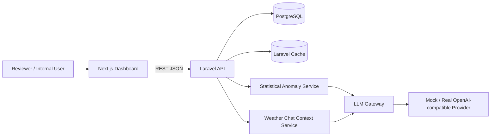

# Weather Monitoring Dashboard — Take-Home Test

Implementasi full-stack untuk studi kasus pemantauan stasiun cuaca. Proyek ini memprioritaskan **ketepatan fungsi, keterbacaan kode, keamanan, pemodelan data yang relevan, dan kemudahan reviewer menjalankan aplikasi**, tanpa menambahkan lapisan arsitektur yang tidak diperlukan.

## Live deployment

Aplikasi telah dideploy dan dapat direview langsung melalui environment production.

| Komponen | Deployment |
|---|---|
| Live dashboard | https://weather-monitoring.studioimpactid.com |
| Backend API | https://weather-monitoring-api.onrender.com |
| API health check | https://weather-monitoring-api.onrender.com/api/health |
| Frontend | Hostinger Managed Node.js / Next.js |
| Backend | Render Docker Web Service |
| Database | Neon PostgreSQL |
| AI provider production | Groq — `openai/gpt-oss-20b` |

Environment production menggunakan PostgreSQL managed dan real LLM provider. Fitur Weather AI Q&A mengambil konteks dari data sensor aktual di database, sedangkan Anomaly Explainer menggunakan z-score sebelum hasil statistik dijelaskan oleh LLM.

Read endpoint dapat diakses tanpa autentikasi untuk memudahkan proses review. Endpoint create/update/delete tetap dilindungi Laravel Sanctum bearer token. Credential write-access production tidak disimpan di repository dan dapat diberikan secara terpisah kepada reviewer bila diperlukan.

> Catatan: backend menggunakan free-tier hosting sehingga cold start dapat terjadi setelah periode tidak aktif. Jika request pertama membutuhkan waktu lebih lama, tunggu beberapa saat lalu refresh halaman.

## Ringkasan teknologi

- **REST API:** Laravel 13 + PHP 8.4.
- **Database:** PostgreSQL 17 dengan migration, foreign key, unique constraint, index, dan check constraint PostgreSQL.
- **Frontend:** Next.js 16 + TypeScript + Tailwind CSS.
- **Pendekatan UI:** komponen Tailwind kustom yang ringan, tanpa ketergantungan pada component kit besar agar proyek tetap ringkas namun konsisten dan profesional.
- **Visualisasi:** Recharts untuk grafik tren dan Leaflet/OpenStreetMap untuk lokasi stasiun.
- **Autentikasi:** Laravel Sanctum bearer token untuk **endpoint yang mengubah data**.
- **AI:** Anomaly Explainer + Weather AI Q&A yang grounded ke data aktual. Z-score dihitung di backend, lalu konteks ringkas yang berasal dari database dikirim melalui adapter LLM OpenAI-compatible yang provider-agnostic. Provider mock deterministik tetap tersedia agar reviewer dapat menjalankan aplikasi tanpa API key.
- **Ketahanan AI:** caching, timeout, retry, rate limit, dan fallback graceful ke mock.
- **Testing:** feature/integration test untuk autentikasi write endpoint, pembuatan station, agregasi, threshold filtering, AI insight, serta validasi dan grounding AI chat.
- **Developer experience:** Docker Compose, health endpoint, CI workflow, spesifikasi OpenAPI, deterministic seed data, dan dependency lock files agar build dapat direproduksi.

## Cakupan requirement take-home

| Requirement | Implementasi |
|---|---|
| CRUD Station | REST endpoint Laravel dengan validasi, kode station unik, koordinat, region, dan elevasi. |
| CRUD Reading | REST endpoint Laravel dengan normalisasi timestamp ke UTC dan validasi nilai sensor. |
| Database + migration | PostgreSQL 17 dengan foreign key, index, unique constraint, dan database constraint. |
| Agregasi harian | Rata-rata harian per station untuk suhu, kelembapan, curah hujan, dan angin, ditambah total akumulasi curah hujan. |
| Threshold analytics | Endpoint berbasis query parameter untuk metric/operator/threshold yang mengembalikan station yang memenuhi kondisi beserta metadata exceedance. |
| Frontend | Manajemen station, peta lokasi, grafik tren tujuh hari, manajemen reading, dan form penambahan reading. |
| Autentikasi | Sanctum bearer token diwajibkan untuk endpoint mutasi; read endpoint tetap mudah diakses reviewer. |
| Automated test | Feature/integration test untuk auth, station write, normalisasi timezone, analytics, AI insight, dan grounded chat. |
| Seed data | Tiga station Indonesia dan 200+ reading; seed deterministik saat ini menghasilkan 700+ sample. |
| AI Opsi 2 | Structured database-grounded RAG Weather AI Q&A menggunakan konteks sensor aktual dari PostgreSQL. |
| AI Opsi 3 | Deteksi anomali statistik menggunakan z-score, lalu LLM menjelaskan hasilnya untuk pengguna non-teknis. |
| Bonus | Live deployment, Docker Compose, AI caching, rate limiting, retry/timeout, dan graceful provider fallback. |

Secara default repository menggunakan provider AI mock yang deterministik agar reviewer dapat menjalankan seluruh aplikasi tanpa secret. Adapter OpenAI-compatible juga telah diuji menggunakan Groq; untuk mengaktifkan provider asli cukup mengubah environment variable.

## Arsitektur



API menggunakan controller tipis, validasi request pada boundary input, Eloquent model untuk persistence umum, dan service hanya pada bagian yang benar-benar memiliki logika domain (`AnalyticsService`, `AiInsightService`, `WeatherChatService`, `LlmGateway`).

Repository layer sengaja **tidak** ditambahkan karena hanya akan menduplikasi kemampuan Eloquent dan menambah kompleksitas tanpa manfaat nyata untuk scope take-home ini.

## Keputusan UX frontend

Dashboard dirancang sebagai workspace operasional internal, bukan halaman marketing. UI mencakup navigasi desktop permanen, indikator status jaringan, kartu KPI sensor, grafik tren tujuh hari dengan pemilihan metric, lokasi station, AI anomaly briefing, dan drawer Weather AI Assistant di sisi kanan untuk grounded Q&A.

Weather AI Assistant tersedia secara global dari halaman Overview, Stations, Readings, dan detail station. Pada halaman detail station, context awal chat otomatis difokuskan pada station tersebut.

Grafik hanya menampilkan satu metric dalam satu waktu untuk menghindari perbandingan visual yang menyesatkan antara nilai dengan unit dan skala berbeda. Form dan halaman CRUD dipisahkan agar overview tetap mudah dibaca saat melakukan operational review.

## Model data

### `stations`

| Field | Keterangan |
|---|---|
| `code` | Kode station unik dan stabil, contoh `SUB-01`. |
| `name` | Nama station yang mudah dibaca manusia. |
| `latitude` / `longitude` | Koordinat geografis yang divalidasi. |
| `elevation_m` | Elevasi dalam meter, nullable. |
| `region` | Nama wilayah yang di-index. |

### `readings`

| Field | Keterangan |
|---|---|
| `station_id` | Foreign key ke station, cascade delete. |
| `recorded_at` | Timestamp UTC. |
| `temperature_c` | Suhu dalam Celsius. |
| `humidity_percent` | Kelembapan 0–100%. |
| `rainfall_mm` | Curah hujan non-negatif dalam milimeter. |
| `wind_speed_mps` | Kecepatan angin non-negatif dalam meter/detik. |

Kombinasi `(station_id, recorded_at)` dibuat unik untuk mencegah duplicate sample pada waktu yang sama. Tabel juga memiliki index timestamp dan composite index station/timestamp untuk mendukung query time-series pada dashboard.

## Seed data

`DatabaseSeeder` membuat tiga station Indonesia:

- `SUB-01` — Surabaya Central.
- `BDG-01` — Bandung Highlands.
- `DPS-01` — Denpasar Coastal.

Seeder menghasilkan reading setiap 3 jam selama 30 hari terakhir hingga waktu UTC saat seed dijalankan, sehingga menghasilkan **setidaknya sekitar 699 reading**.

Generator dibuat deterministik (`mt_srand(20260807)`) dan sengaja menyisipkan beberapa nilai tidak biasa agar fitur anomaly detection dapat terlihat ketika direview.

## Ringkasan API

Read endpoint dibuat public agar proses review mudah. Seluruh operasi create/update/delete membutuhkan header `Authorization: Bearer <token>`.

| Method | Endpoint | Fungsi |
|---|---|---|
| `POST` | `/api/auth/login` | Mendapatkan Sanctum bearer token. |
| `POST` | `/api/auth/logout` | Mencabut token aktif. |
| `GET` | `/api/stations` | Daftar station + jumlah reading/latest timestamp. |
| `GET` | `/api/stations/{id}` | Detail station. |
| `POST` | `/api/stations` | Membuat station. |
| `PUT` | `/api/stations/{id}` | Mengubah station. |
| `DELETE` | `/api/stations/{id}` | Menghapus station. |
| `GET` | `/api/readings` | Reading terpaginate; dapat difilter berdasarkan station/from/to. |
| `POST` | `/api/readings` | Menambah reading. |
| `PUT` | `/api/readings/{id}` | Mengubah reading. |
| `DELETE` | `/api/readings/{id}` | Menghapus reading. |
| `GET` | `/api/stations/{id}/daily-averages` | Rata-rata harian + total curah hujan. |
| `GET` | `/api/analytics/threshold` | Station dengan reading yang melewati threshold configurable. |
| `GET` | `/api/stations/{id}/ai-insight` | Penjelasan tren/anomali 7 hari. |
| `POST` | `/api/ai/chat` | Grounded Q&A menggunakan konteks station yang berasal dari database. |
| `GET` | `/api/health` | Health check API. |

Kontrak request/response lengkap tersedia di [`docs/openapi.yaml`](docs/openapi.yaml).

### Contoh agregasi

```http
GET /api/stations/1/daily-averages?from=2026-08-01&to=2026-08-07
```

Response memuat rata-rata suhu, kelembapan, curah hujan, dan kecepatan angin per hari, serta `total_rainfall_mm`. Total curah hujan ikut disediakan karena lebih berguna secara operasional walaupun requirement utama meminta rata-rata harian.

### Contoh threshold

```http
GET /api/analytics/threshold?metric=temperature_c&operator=gt&threshold=35
```

Metric yang diperbolehkan:

- `temperature_c`
- `humidity_percent`
- `rainfall_mm`
- `wind_speed_mps`

Operator yang diperbolehkan:

- `gt`
- `gte`
- `lt`
- `lte`

**Asumsi:** sebuah station dianggap memenuhi threshold apabila **setidaknya satu reading aktual** pada rentang waktu yang dipilih melewati threshold. Response juga menyertakan jumlah exceedance, nilai paling ekstrem yang teramati, dan timestamp crossing terbaru.

## Desain AI

Fitur AI sengaja di-ground-kan ke data database dan tidak menggunakan unconstrained prompt.

### Anomaly Explainer

Alurnya:

1. Mengambil reading terbaru dari station yang dipilih.
2. Menghitung mean, min, max, dan standard deviation per metric di PHP.
3. Mendeteksi anomali dengan `|z-score| >= 2.0`.
4. Membandingkan rata-rata separuh awal dan separuh akhir periode untuk menentukan arah tren sederhana.
5. Mengirim hanya statistik, tren, dan data anomali yang telah diringkas ke LLM gateway.
6. Meminta model menjelaskan data tersebut dalam Bahasa Indonesia tanpa membuat kepastian yang tidak didukung data.
7. Menyimpan hasil ke cache menggunakan kombinasi station + periode + timestamp reading terbaru agar cache terinvalidasi secara natural ketika ada data sensor baru.

### Weather AI Q&A — Structured RAG

`POST /api/ai/chat` menggunakan pendekatan **structured database-grounded RAG**.

Backend mengambil reading aktual dari PostgreSQL, menghitung statistik dan anomali per station, lalu memasukkan konteks terstruktur tersebut ke prompt LLM pada setiap pertanyaan.

Konteks mencakup:

- range suhu per station,
- range kelembapan,
- range kecepatan angin,
- total curah hujan,
- latest measurements,
- top z-score anomalies.

Browser dapat mengirim history percakapan singkat, tetapi backend selalu menambahkan konteks sensor terbaru pada setiap turn. Prompt juga menginstruksikan LLM untuk menjawab hanya berdasarkan context yang tersedia dan menyatakan secara eksplisit jika data tidak mencukupi.

Response chat di-cache berdasarkan provider/model/pertanyaan/timestamp data agar pertanyaan identik dengan kondisi data sama tidak memanggil LLM berulang kali.

Vector database sengaja tidak digunakan karena sumber data bersifat numerik dan terstruktur. Untuk kasus ini, deterministic SQL retrieval dan agregasi server-side lebih tepat, dapat diaudit, dan lebih relevan dibanding semantic embedding search.

### Konfigurasi provider

Provider default tidak membutuhkan API key:

```env
AI_PROVIDER=mock
```

Untuk menggunakan provider asli, buat API key pada developer console resmi provider, simpan hanya di `.env` lokal, dan jangan commit secret tersebut ke Git.

Aplikasi mendukung endpoint chat-completions yang kompatibel dengan OpenAI API.

Contoh Groq:

```env
AI_PROVIDER=groq
AI_MODEL=openai/gpt-oss-20b
AI_API_KEY=<your-groq-api-key>
AI_BASE_URL=https://api.groq.com/openai/v1
```

Contoh provider OpenAI-compatible lain:

```env
AI_PROVIDER=openai
AI_MODEL=<model-name>
AI_API_KEY=<key>
AI_BASE_URL=https://api.openai.com/v1
```

Jika provider mengalami timeout, rate limit, mengembalikan response invalid, atau salah konfigurasi, aplikasi mencatat kegagalan tersebut dan dapat fallback ke narrator mock deterministik ketika:

```env
AI_FALLBACK_TO_MOCK=true
```

## Environment variable

Untuk Docker Compose, copy `.env.example` di root menjadi `.env`.

Default lokal sengaja dibuat reviewer-friendly. Ganti credential sebelum digunakan pada deployment publik.

| Variable | Fungsi |
|---|---|
| `POSTGRES_DB`, `POSTGRES_USER`, `POSTGRES_PASSWORD` | Credential database PostgreSQL. |
| `APP_KEY` | Laravel application encryption key. |
| `APP_URL` | Base URL backend. |
| `FRONTEND_URL` | Origin frontend yang diizinkan oleh CORS. |
| `NEXT_PUBLIC_API_BASE_URL` | URL API yang dimasukkan ke build Next.js. |
| `SEED_ADMIN_NAME`, `SEED_ADMIN_EMAIL`, `SEED_ADMIN_PASSWORD` | Akun reviewer lokal yang dibuat seeder. |
| `AI_PROVIDER`, `AI_MODEL` | Pemilihan provider/model AI; `mock` dapat berjalan tanpa API key. |
| `AI_API_KEY`, `AI_BASE_URL` | Credential/base URL provider OpenAI-compatible. |
| `AI_TIMEOUT_SECONDS` | Timeout external AI request. |
| `AI_FALLBACK_TO_MOCK` | Fallback deterministik ketika real provider gagal. |
| `AI_CACHE_TTL_SECONDS` | Durasi cache hasil AI. |

## Menjalankan dengan Docker Compose

Prasyarat:

- Docker
- Docker Compose

Copy environment file:

```bash
cp .env.example .env
```

Jalankan aplikasi:

```bash
docker compose up --build
```

Akses:

- Frontend: `http://localhost:3000`
- API health check: `http://localhost:8000/api/health`

Akun demo lokal yang dibuat seeder:

```text
Email: reviewer@example.test
Password: ChangeThisLocalOnly123!
```

Credential tersebut hanya ditujukan untuk local review. Ganti `SEED_ADMIN_EMAIL` dan `SEED_ADMIN_PASSWORD` sebelum deployment publik.

Seeder dibuat idempotent untuk dataset cuaca yang dihasilkan: jika sebuah seeded station sudah memiliki reading, seeder tidak menghapus atau mengulang dataset tersebut sehingga perubahan reviewer tidak hilang saat container restart.

## Menjalankan secara manual

### Backend

Requirement:

- PHP 8.3+
- Composer
- PostgreSQL

```bash
cd backend
cp .env.example .env
composer install
php artisan key:generate
php artisan migrate --seed
php artisan serve
```

### Frontend

Requirement:

- Node.js 22+

```bash
cd frontend
cp .env.example .env.local
npm ci
npm run dev
```

## Testing dan quality check

### Backend dengan Docker

Direkomendasikan:

```bash
docker compose --profile test run --rm --build backend-test
```

Image `backend` normal hanya meng-install dependency production (`--no-dev`). Target `backend-test` terpisah menyertakan PHPUnit/Collision dan `pdo_sqlite`, sehingga test terisolasi dari production image dan menggunakan SQLite in-memory seperti yang dikonfigurasi di `phpunit.xml`.

### Backend tanpa Docker

```bash
cd backend
composer install
composer test
composer lint
```

### Frontend

```bash
cd frontend
npm run typecheck
npm run lint
npm run build
```

Environment test backend menggunakan SQLite in-memory untuk kecepatan dan isolasi. Runtime production/demo menggunakan PostgreSQL. PostgreSQL-specific check constraint diaplikasikan secara conditional agar migration yang sama tetap dapat diuji pada SQLite.

## Checklist verifikasi reviewer

Urutan verifikasi singkat sebelum submission atau review:

```bash
# Backend tests
docker compose --profile test build backend-test
docker compose --profile test run --rm backend-test

# Backend formatting
docker compose --profile test run --rm backend-test ./vendor/bin/pint --test

# Frontend quality
docker compose exec frontend npm run lint
docker compose exec frontend npm run typecheck

# Production images
docker compose build

# Runtime health
docker compose up -d
curl http://localhost:8000/api/health
```

Pada scope take-home saat ini, backend memiliki **8 feature/integration tests dengan 30 assertions**.

## Keputusan keamanan

- Write route dilindungi Sanctum bearer token dengan ability `write`.
- Login endpoint dibatasi 5 request/menit/IP.
- AI insight dibatasi 30 request/menit/client.
- AI chat dibatasi 10 request/menit/client.
- Validasi server-side ketat untuk koordinat, nilai sensor cuaca, pagination, dan analytics metric/operator.
- Unique database constraint mencegah duplicate station/timestamp reading bahkan jika validation layer dilewati secara concurrent.
- Secret disimpan melalui environment variable dan file `.env` di-ignore oleh Git.
- CORS hanya mengizinkan origin frontend yang telah dikonfigurasi.
- Frontend hanya mengirim bearer token pada mutation request dan menyimpan demo token di `sessionStorage`, bukan persistent local storage.
- Security response header mencegah framing, MIME sniffing, serta browser permission yang tidak diperlukan.
- LLM hanya menerima measurement/statistics terstruktur, bukan database credential atau akses SQL bebas.
- Endpoint Q&A tidak memberikan akses database langsung kepada model; retrieval dan aggregation selalu dilakukan secara deterministik di backend.
- Error dari external AI tidak menampilkan provider response body atau secret kepada user.

Untuk sistem production yang benar-benar internet-facing, pengembangan berikutnya akan mencakup HttpOnly/Secure cookie dengan same-origin deployment atau BFF layer, nonce-based CSP, secret rotation, audit log, dan TLS/rate limiting di level infrastruktur.

## Konvensi coding

- Identifier dan komentar kode menggunakan Bahasa Inggris secara konsisten.
- PHP mengikuti PSR-12 melalui Laravel Pint.
- Typed method signature digunakan bila relevan.
- TypeScript menggunakan `strict: true`.
- API/domain type dibuat eksplisit.
- Controller dijaga tetap tipis; business calculation ditempatkan pada service.
- Tidak menggunakan generic repository/base-service abstraction yang tidak diperlukan.
- Query parameter menggunakan allow-list, bukan interpolasi arbitrary field name.
- UTC digunakan sebagai timezone canonical untuk storage dan API.
- Small component/helper lebih diprioritaskan daripada utility framework yang terlalu besar.

## Asumsi

1. `Station.code` ditambahkan sebagai identifier machine-readable yang stabil walaupun soal hanya meminta nama/lokasi/elevasi/wilayah.
2. Public read access dianggap dapat diterima karena soal hanya mewajibkan autentikasi pada endpoint yang mengubah data.
3. Threshold dianggap terpenuhi ketika actual reading melewati threshold pada periode yang dipilih, bukan ketika daily average melewatinya.
4. Daily rainfall menyediakan rata-rata sekaligus accumulated total; nilai rata-rata yang diminta soal tetap tersedia.
5. Output AI merupakan alat bantu interpretasi, bukan ramalan meteorologi atau dasar keputusan keselamatan.

## Jika tersedia waktu lebih banyak

Beberapa pengembangan lanjutan yang relevan:

- Sensor ingestion endpoint dengan idempotency key / batch upload.
- TimescaleDB atau PostgreSQL partitioning untuk volume time-series jangka panjang.
- Background job dan streaming response untuk workload AI yang lebih berat.
- Role-based access control dan audit trail untuk data mutation.
- Observability menggunakan Prometheus/OpenTelemetry.
- End-to-end test menggunakan Playwright.
- Pagination/virtualization untuk jumlah station yang sangat besar.
- Alert policy nyata yang membedakan operational threshold dan anomaly statistik.

## Struktur repository

```text
.
├── backend/                 Laravel API
│   ├── app/
│   │   ├── Http/
│   │   ├── Models/
│   │   └── Services/
│   ├── database/
│   ├── routes/
│   └── tests/
├── frontend/                Next.js dashboard
│   └── src/
│       ├── app/
│       ├── components/
│       └── lib/
├── docs/openapi.yaml        API contract
├── docker-compose.yml
└── .github/workflows/ci.yml
```

## Library open-source yang digunakan

Proyek menggunakan:

- Laravel dan Laravel Sanctum — `laravel.com`
- Next.js — `nextjs.org`
- React — `react.dev`
- Tailwind CSS — `tailwindcss.com`
- Recharts — `recharts.org`
- Leaflet — `leafletjs.com`
- OpenStreetMap tiles/data — `openstreetmap.org`
- PHPUnit — `phpunit.de`
- Laravel Pint — dokumentasi Laravel
- FakerPHP — `fakerphp.org`

Constraint dan versi dependency yang dikunci tersedia pada:

- `backend/composer.json`
- `backend/composer.lock`
- `frontend/package.json`
- `frontend/package-lock.json`

Live Demo:
https://weather-monitoring.studioimpactid.com

Backend API:
https://weather-monitoring-api.onrender.com

Health:
https://weather-monitoring-api.onrender.com/api/health

Frontend: Hostinger Managed Node.js / Next.js
Backend: Render Docker Web Service
Database: Neon PostgreSQL
AI: Groq — openai/gpt-oss-20b